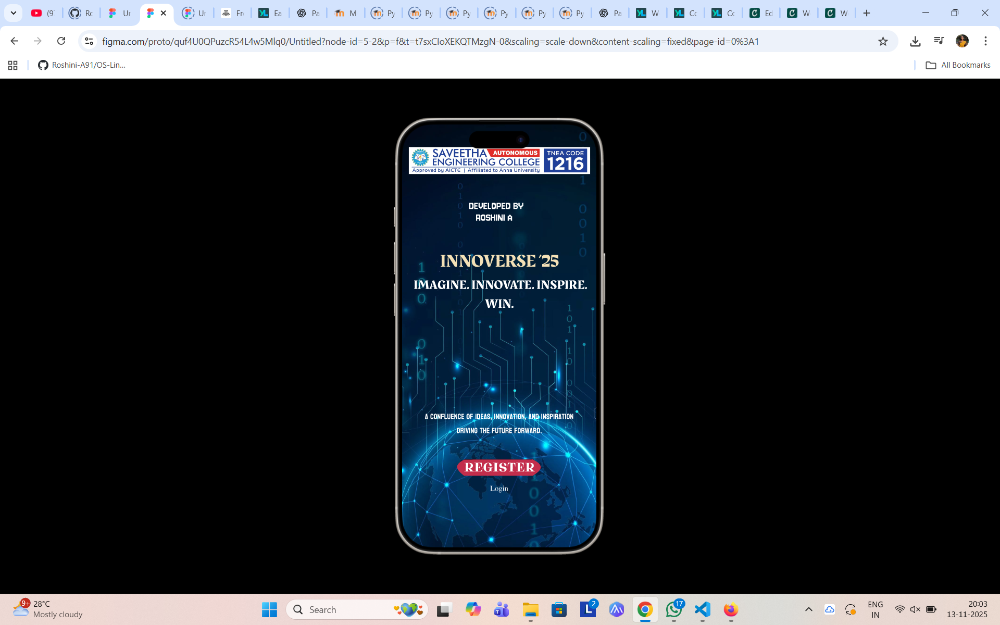
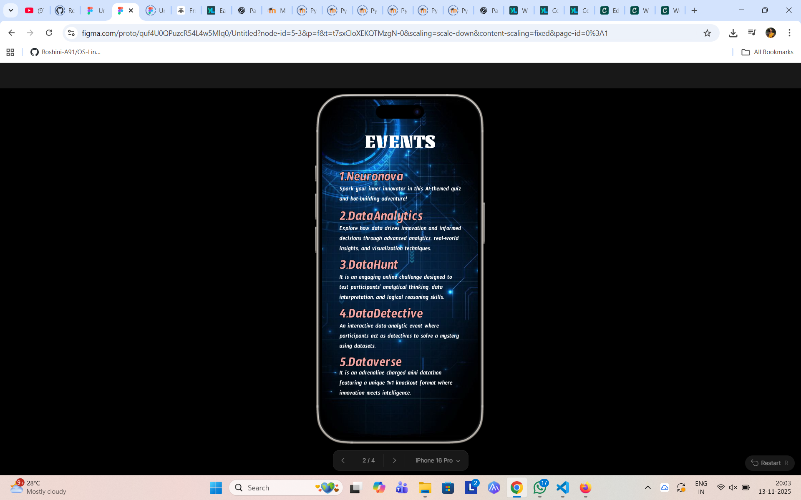
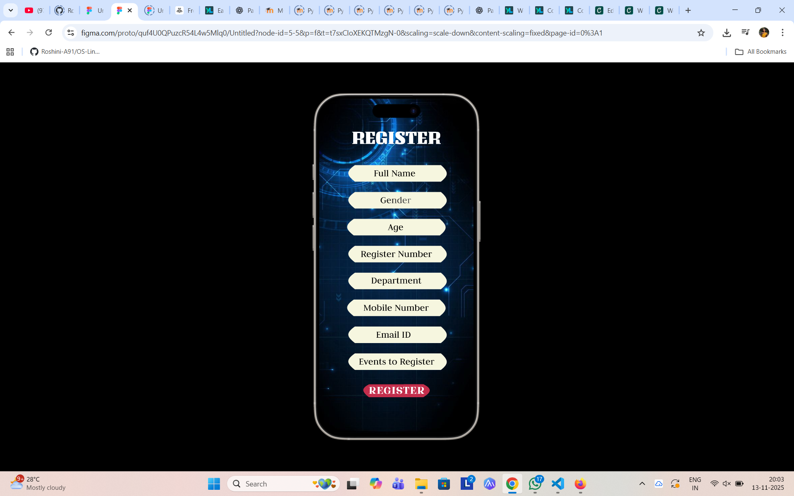
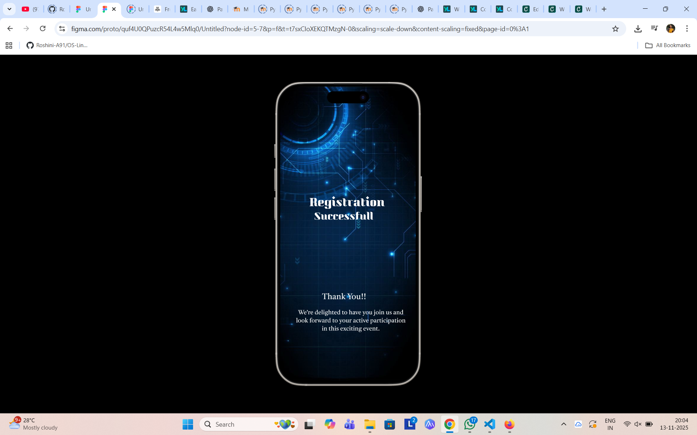

# Ex09 Event Registration Web Application
## Date:

## AIM:
To design, develop and deploy a web application for event registration.

## DESIGN STEPS:

### Step 1:
Create a new frame.

### Step 2:
Select any one preset size of your choice.

### Step 3:
Select the shapes you need.

### Step 4:
Import images as needed.

### Step 5:
Create pages based on your need and link them.

### Step 6:

Validate the HTML and CSS code.

### Step 6:

Publish the website in the given URL.

## DESIGN TOOL:
Figma

## CODE:

Home Page:

```
<!DOCTYPE html>
<html>
<head>
  <meta charset="UTF-8">
  <meta name="viewport" content="width=device-width, initial-scale=1.0">
  <title>Exported Figma Design</title>
  
  <link rel="stylesheet" href="styles.css">
</head>
<body>


</body>
</html>

:root {
}


/* CSS Reset */
* {
  margin: 0;
  padding: 0;
  box-sizing: border-box;
}

body {
  width: 100%;
  min-height: 100vh;
  overflow-x: hidden;
}

img {
  max-width: 100%;
  height: auto;
}

.iphone-16-pro-1-1 {
@media (max-width: 1440px) {
  .iphone-16-pro-1-1 {
    padding-left: 24px;
    padding-right: 24px;
  }
}

@media (max-width: 768px) {
  .iphone-16-pro-1-1 {
    padding-left: 16px;
    padding-right: 16px;
  }
}
  flex-grow: 0;
  flex-shrink: 1;
  flex-basis: auto;
  width: 100%;
  height: auto;
}

```

Events Page:

```
<!DOCTYPE html>
<html>
<head>
  <meta charset="UTF-8">
  <meta name="viewport" content="width=device-width, initial-scale=1.0">
  <title>Exported Figma Design</title>
  
  <link rel="stylesheet" href="styles.css">
</head>
<body>


</body>
</html>

:root {
}


/* CSS Reset */
* {
  margin: 0;
  padding: 0;
  box-sizing: border-box;
}

body {
  width: 100%;
  min-height: 100vh;
  overflow-x: hidden;
}

img {
  max-width: 100%;
  height: auto;
}

.iphone-16-pro-1-1 {
@media (max-width: 1440px) {
  .iphone-16-pro-1-1 {
    padding-left: 24px;
    padding-right: 24px;
  }
}

@media (max-width: 768px) {
  .iphone-16-pro-1-1 {
    padding-left: 16px;
    padding-right: 16px;
  }
}
  flex-grow: 0;
  flex-shrink: 1;
  flex-basis: auto;
  width: 100%;
  height: auto;
}
```

Register Page:

```
<!DOCTYPE html>
<html>
<head>
  <meta charset="UTF-8">
  <meta name="viewport" content="width=device-width, initial-scale=1.0">
  <title>Exported Figma Design</title>
  
  <link rel="stylesheet" href="styles.css">
</head>
<body>


</body>
</html>

:root {
}


/* CSS Reset */
* {
  margin: 0;
  padding: 0;
  box-sizing: border-box;
}

body {
  width: 100%;
  min-height: 100vh;
  overflow-x: hidden;
}

img {
  max-width: 100%;
  height: auto;
}

.iphone-16-pro-2-1 {
@media (max-width: 1440px) {
  .iphone-16-pro-2-1 {
    padding-left: 24px;
    padding-right: 24px;
  }
}

@media (max-width: 768px) {
  .iphone-16-pro-2-1 {
    padding-left: 16px;
    padding-right: 16px;
  }
}
  flex-grow: 0;
  flex-shrink: 1;
  flex-basis: auto;
  width: 100%;
  height: auto;
}
```

Final Page:

```
<!DOCTYPE html>
<html>
<head>
  <meta charset="UTF-8">
  <meta name="viewport" content="width=device-width, initial-scale=1.0">
  <title>Exported Figma Design</title>
  
  <link rel="stylesheet" href="styles.css">
</head>
<body>


</body>
</html>

:root {
}


/* CSS Reset */
* {
  margin: 0;
  padding: 0;
  box-sizing: border-box;
}

body {
  width: 100%;
  min-height: 100vh;
  overflow-x: hidden;
}

img {
  max-width: 100%;
  height: auto;
}

.iphone-16-pro-3-1 {
@media (max-width: 1440px) {
  .iphone-16-pro-3-1 {
    padding-left: 24px;
    padding-right: 24px;
  }
}

@media (max-width: 768px) {
  .iphone-16-pro-3-1 {
    padding-left: 16px;
    padding-right: 16px;
  }
}
  flex-grow: 0;
  flex-shrink: 1;
  flex-basis: auto;
  width: 100%;
  height: auto;
}
```

## OUTPUT:






## RESULT:
The program to design, develop and deploy a web application for event registration is completed successfully.
